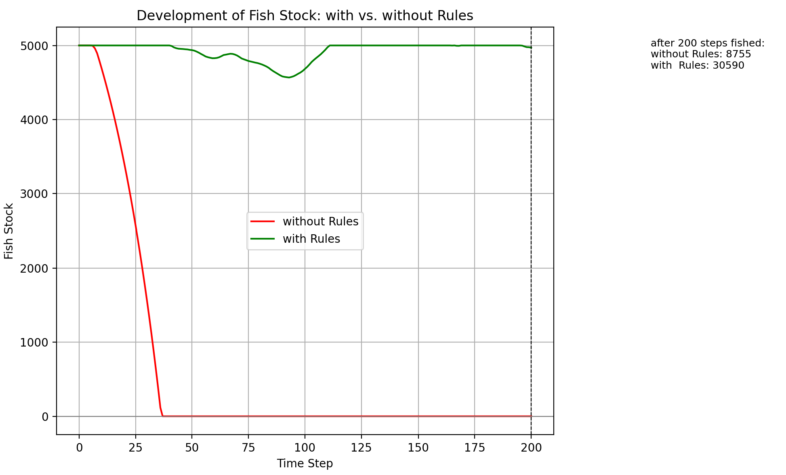
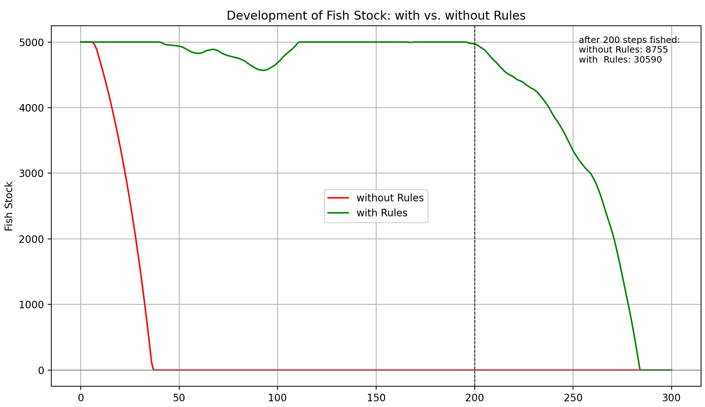

# Fischerei und Allmende 

## Abstract
Diese Arbeit untersucht den Einfluss sozialer Nähe und Isolation auf das Verhalten von Akteuren*innen sowie auf die Stabilität einer gemeinsam genutzten Ressource. Hierzu wurde ein agentenbasiertes Modell entwickelt, in dem 30 Fischer*innen auf einem zweidimensionalen Raster agieren und auf einen gemeinsamen Fischbestand zugreifen. Ausgehend von theoretischen Überlegungen zu Allmendegütern werden zwei Szenarien verglichen: ein Szenario ohne soziale Regeln sowie ein Szenario, in dem lokale Begegnungen kooperatives Verhalten fördern. Die Ergebnisse zeigen deutliche Unterschiede zwischen beiden Bedingungen. Während im Szenario ohne Regeln egoistisches Verhalten kontinuierlich zunimmt und der Fischbestand innerhalb des Simulationszeitraums kollabiert, bleibt die Ressource im Szenario mit sozialen Regeln langfristig stabil und nahe ihrer maximalen Kapazität. Die Simulation verdeutlicht damit die Bedeutung sozialer Interaktionen für die nachhaltige Nutzung gemeinsamer Ressourcen. Die Aussagekraft der Ergebnisse wird jedoch durch die bewusste Vereinfachung des Modells begrenzt, insbesondere durch die Modellierung eines einzigen globalen Fischbestands sowie die Reduktion sozialer Prozesse auf eine einfache Verhaltensanpassungsregel.

## 1. Introduction
Die Nutzung gemeinsam genutzter Ressourcen zählt zu den klassischen Fragestellungen der Sozial- und Umweltwissenschaften. Besonders relevant ist dabei die Frage, unter welchen Bedingungen Individuen bereit sind, ihre eigenen Interessen zugunsten des langfristigen Erhalts einer Ressource einzuschränken. Fischbestände, Weideflächen oder Bewässerungssysteme stellen typische Beispiele solcher Allmendegüter (Common-Pool Resources) dar.

Einen wichtigen Beitrag zur theoretischen Diskussion lieferte Garrett Hardin (1968) mit seinem einflussreichen Essay 
„The Tragedy of the Commons“. Hardin argumentiert, dass Individuen bei freiem Zugang zu einer gemeinsamen Ressource dazu neigen, ihren persönlichen Nutzen zu maximieren. Da die negativen Folgen der Übernutzung von allen Beteiligten getragen werden, führt dieses Verhalten langfristig zur Erschöpfung der Ressource.

Dieser Sichtweise widersprach Elinor Ostrom (1990) auf Grundlage umfangreicher empirischer Untersuchungen. Sie zeigte, dass Gemeinschaften durchaus in der Lage sind, gemeinsame Ressourcen dauerhaft zu bewirtschaften, wenn geeignete Regeln, Kontrollmechanismen und soziale Normen etabliert werden. Ostrom identifizierte mehrere Gestaltungsprinzipien erfolgreicher Selbstverwaltung, darunter klar definierte Nutzungsrechte, gemeinschaftliche Regelsetzung und soziale Kontrolle innerhalb der Nutzergruppe.

Aufbauend auf diesen Arbeiten betonte Janssen (2010) die Bedeutung dynamischer Wechselwirkungen zwischen menschlichem Verhalten und ökologischen Prozessen. Seine Untersuchungen verdeutlichen, dass nachhaltige Ressourcennutzung nicht allein von institutionellen Regeln abhängt, sondern auch von den Rückkopplungen zwischen sozialem und ökologischem System.

Vor diesem theoretischen Hintergrund untersucht die vorliegende Arbeit einen spezifischen Aspekt gemeinschaftlicher Ressourcennutzung: die Bedeutung sozialer Nähe und sozialer Isolation. Während viele Modelle institutionelle Regeln oder Sanktionen in den Mittelpunkt stellen, konzentriert sich das hier entwickelte Modell auf die Frage, ob bereits lokale soziale Begegnungen das Verhalten von Akteur*innen beeinflussen können.

Daraus ergibt sich folgende Forschungsfrage:

Wie wirken sich soziale Nähe beziehungsweise Isolation auf das Verhalten von Fischer*innen und damit auf die Stabilität einer gemeinsam genutzten Ressource aus?

Zur Beantwortung dieser Frage wurde ein agentenbasiertes Simulationsmodell entwickelt, in dem Fischer*innen auf einem Raster agieren und einen gemeinsamen Fischbestand nutzen. Verglichen werden zwei Szenarien: eines ohne soziale Einflussnahme und eines, in dem Begegnungen zwischen benachbarten Fischer*innen kooperatives Verhalten fördern. Ziel des Modells ist es nicht, reale Fischereisysteme vollständig abzubilden, sondern die grundlegende Bedeutung sozialer Interaktionen für die nachhaltige Nutzung gemeinsamer Ressourcen sichtbar zu machen.

## 2. Method

### Modellaufbau und Simulationsumgebung
Das Modell wurde als agentenbasierte Simulation in Python implementiert. Die tatsächliche Modellbeschreibung orientiert sich an der implementierten Version des Codes. Die Simulationsumgebung besteht aus einem zweidimensionalen Raster mit einer Größe von 20×20 Feldern. Die Felder dienen ausschließlich zur räumlichen Positionierung der Fischer*innen und besitzen keine eigenen Fischbestände. Die Simulation läuft über 200 diskrete Zeitschritte. Alle Fischer*innen werden zu Beginn zufällig auf dem Raster verteilt. Die Bewegung und Interaktion der Akteur*innen erfolgen ausschließlich innerhalb dieser räumlichen Umgebung.


### Fischbestand
Der Fischbestand wird als eine einzige globale Ressource für den gesamten See modelliert. Im Gegensatz zu früheren Konzeptüberlegungen existieren keine lokalen Fisch-Patches und keine räumlich verteilten Fischpopulationen. Alle Fischer*innen greifen auf denselben gemeinsamen Bestand zu.
Die wichtigsten Parameter lauten:
Anfangsbestand "start_fish"= 5000 Fische
Maximale Kapazität "max_fish" = 5000 Fische
Minimalbestand "min_fish" = 0 Fische
Regenerationsrate "regen_rate" = 3,66% pro Zeitschritt

Der Fischbestand wird nach jedem Zeitschritt regeneriert und kann die maximale Kapazität nicht überschreiten.

### Fischer*innen-Agenten
Das Modell enthält 30 Fischer*innen, die als autonome Agenten implementiert sind. Jede Person besitzt drei Zustandsvariablen:
x-Position auf dem Raster
y-Position auf dem Raster
Verhaltenswert („behavior“)
Alle Fischer*innen starten mit einem Verhaltenswert von 1 und damit maximal kooperativem Verhalten. Der Verhaltenswert liegt stets zwischen 1 und 9.
Die Bedeutung des Verhaltenswerts ist unmittelbar mit der Fangmenge verknüpft:
Interpretation Verhaltenswert:
1 … stark kooperativ
2-3 … kooperativ
4-6 … mittleres Verhalten
7-8 … egoistisch
9 … maximal egoistisch
Der Verhaltenswert bestimmt direkt die Anzahl der Fische, die eine Person pro Zeitschritt fängt. Ein*e Fischer*in mit Verhalten 1 entnimmt einen Fisch pro Zeitschritt, ein*e Fischer*in mit Verhalten 9 entsprechend neun Fische.

### Nachbarschaft und soziale Nähe
Die Wahrnehmung anderer Fischer*innen erfolgt über eine Moore-Nachbarschaft. Dabei werden alle acht unmittelbar angrenzenden Felder berücksichtigt.
Der folgende Codeausschnitt implementiert diese Nachbarschaftsdefinition.
```python
def get_neighbors(self, fisher):
    neighbors = []
    for other in self.fishers:
        if other is fisher:
            continue

        dx = abs(fisher["x"] - other["x"])
        dy = abs(fisher["y"] - other["y"])

        if dx <= 1 and dy <= 1:
            neighbors.append(other)

    return neighbors
```
Technisch überprüft die Funktion, welche Fischer*innen höchstens ein Feld horizontal, vertikal oder diagonal entfernt sind. Die Modellannahme besteht darin, dass soziale Wahrnehmung nur lokal erfolgt. Die Auswirkungen dieser Regel sind zentral für die Forschungsfrage, da Begegnungen innerhalb dieser Nachbarschaft das spätere Verhalten beeinflussen können.

### Fischfang
Zu Beginn jedes Zeitschritts wird Fischfang betrieben. Die individuelle Fangmenge entspricht unmittelbar dem aktuellen Verhaltenswert.
Die Gesamtfangmenge ergibt sich schließlich aus der Summe aller individuellen Fangmengen.
Falls die gewünschte Gesamtfangmenge größer ist als der aktuell verfügbare Bestand, wird lediglich der verbleibende Fischbestand entnommen, der Bestand kann somit niemals negativ werden. Die tatsächliche Fangmenge wird für jeden Zeitschritt gespeichert und zusätzlich als kumulierter Gesamtfang dokumentiert.

### Verhaltensanpassung
Die Verhaltensanpassung stellt den zentralen Mechanismus des Modells dar. Hier unterscheiden sich die beiden untersuchten Szenarien.
Der entsprechende Code hierzu sieht wie folgt aus.
```python
def adapt_behavior(self):
    for fisher in self.fishers:
        neighbors = self.get_neighbors(fisher)

        if self.rules:
            if len(neighbors) > 0:
                fisher["behavior"] -= 1
            else:
                fisher["behavior"] += 1
        else:
            fisher["behavior"] += 1
```
Der Code implementiert die Verhaltensanpassung der Fischer*innen in jedem Zeitschritt. Im Szenario mit Regeln wird zunächst geprüft, ob sich andere Fischer*innen in der Moore-Nachbarschaft befinden. Ist dies der Fall, wird der Verhaltenswert um eins reduziert, wodurch die betreffende Person kooperativer wird. Befindet sich ein*e Fischer*in hingegen in Isolation, steigt der Verhaltenswert um eins und damit auch die Tendenz zu egoistischem Verhalten. Im Szenario ohne Regeln erhöht sich der Verhaltenswert unabhängig von der Anwesenheit anderer Akteur*innen kontinuierlich. Die zugrunde liegende Modellannahme lautet, dass soziale Begegnungen Rücksichtnahme und kooperatives Verhalten fördern, während Isolation egoistische Verhaltensweisen begünstigt. Dieser Mechanismus bildet den zentralen Unterschied zwischen beiden Szenarien und bestimmt maßgeblich die langfristige Entwicklung des Fischbestands.

### Szenario ohne Regeln
Im Szenario ohne Regeln besitzen Begegnungen keinerlei soziale Bedeutung. Unabhängig von ihrer Umgebung werden alle Fischer*innen in jedem Zeitschritt egoistischer. Der Verhaltenswert steigt kontinuierlich um eins an, bis die Obergrenze von 9 erreicht wird.
Dadurch nimmt die Fangmenge dauerhaft zu, was den Druck auf die Ressource kontinuierlich erhöht.

### Szenario mit Regeln
Im Szenario mit Regeln beeinflussen soziale Begegnungen das Verhalten unmittelbar.

Treffen Fischer*innen auf mindestens eine*n Nachbarn*in, sinkt ihr Egoismus.
Befinden sie sich isoliert, steigt ihr Egoismus.
Der Verhaltenswert bleibt stets zwischen 1 und 9 begrenzt.

Die zentrale Modellannahme lautet somit, dass soziale Nähe Rücksichtnahme erzeugt, während Isolation egoistisches Verhalten begünstigt.
Diese einfache Regel erzeugt die wesentlichen Unterschiede zwischen beiden Simulationen und bildet die theoretische Verbindung zu Ostroms Überlegungen über die Bedeutung sozialer Institutionen und gemeinsamer Regeln.

### Bewegung der Fischer*innen
Nach der Verhaltensanpassung bewegen sich die Fischer*innen zufällig über das Raster. Pro Zeitschritt kann eine Bewegung um maximal ein Feld in horizontaler, vertikaler oder diagonaler Richtung erfolgen. Bewegungen außerhalb der Grenzen des Sees sind nicht zulässig. Zudem können bereits von anderen Fischer*innen besetzte Felder nicht betreten werden. Durch die zufällige Bewegung entstehen fortlaufend neue räumliche Konstellationen, wodurch sich Begegnungen und Phasen der Isolation dynamisch verändern. Da die Verhaltensanpassung unmittelbar von der lokalen Nachbarschaft abhängt, stellt die Bewegung einen zentralen Mechanismus für die Entstehung der sozialen Dynamik im Modell dar.

### Regeneration des Fischbestands
Nach dem Fischfang wächst der Fischbestand entsprechend einer festgelegten Regenerationsrate. Der entsprechende Mechanismus ist im folgenden Code dargestellt.
```python
def regenerate_fish(self):
    self.fish_stock += self.fish_stock * regen_rate

    if self.fish_stock > max_fish:
        self.fish_stock = max_fish
```
Der Code implementiert einen proportionalen Wachstumsprozess, bei dem der aktuelle Fischbestand in jedem Zeitschritt um 3,66 % erhöht wird. Anschließend wird überprüft, ob die maximale Kapazität des Sees überschritten wird. In diesem Fall wird der Bestand auf den festgelegten Maximalwert von 5000 Fischen begrenzt.

Die Modellannahme besteht darin, dass sich größere Bestände schneller erholen als kleinere Bestände, da das Wachstum proportional zur vorhandenen Population erfolgt. Die Regenerationsrate von 3,66 % wurde dabei so gewählt, dass der Fischbestand bei kooperativem Verhalten langfristig erhalten bleiben kann, während eine dauerhaft hohe Entnahme durch egoistisches Verhalten weiterhin zu einer Übernutzung der Ressource führt. Dadurch wird sichergestellt, dass die beobachteten Unterschiede zwischen den beiden Szenarien primär auf die soziale Dynamik der Fischer*innen und nicht ausschließlich auf die ökologische Regeneration zurückzuführen sind.

Der Regenerationsmechanismus wirkt dem durch den Fischfang verursachten Bestandsrückgang entgegen und bestimmt gemeinsam mit dem Verhalten der Fischer*innen, ob die Ressource langfristig stabil bleibt oder kollabiert.

### Datenspeicherung
Während der Simulation werden mehrere Kenngrößen gespeichert:
Fischbestand pro Zeitschritt (history)
Fangmenge pro Zeitschritt (catch_per_step)
kumulierte Gesamtfangmenge (total_caught)
Diese Daten bilden die Grundlage für die spätere Auswertung der Ressourcenentwicklung und des Entnahmedrucks.

### Visualisierung
Zur Analyse werden zwei parallele Simulationen dargestellt:
1.	Szenario ohne Regeln
2.	Szenario mit Regeln
Die Fischer*innen werden farblich nach ihrem Verhalten codiert, hierbei steht die Farbe Grün für ein kooperatives Verhalten (1–3), Gelb verdeutlicht ein mittleres Verhalten (4–6) und die Visualisierung in Rot zeigt egoistisch (7–9)an.
Zusätzlich wird während der Simulation der aktuelle Fischbestand angezeigt. Nach Abschluss wird die Entwicklung des Fischbestands beider Szenarien in einem Vergleichsdiagramm dargestellt.

### Verwendete Bibliotheken
#### matplotlib.pyplot
Die Bibliothek matplotlib.pyplot übernimmt die grafische Darstellung des Modells. Sie wird verwendet, um die Positionen der Fischer*innen auf dem Raster darzustellen, die Vergleichsgrafiken des Fischbestands zu erzeugen und die Ergebnisse visuell auszuwerten.

#### matplotlib.animation.FuncAnimation
FuncAnimation ermöglicht die zeitliche Animation der Simulation. Nach jedem Zeitschritt werden beide Szenarien aktualisiert und neu gezeichnet, wodurch die Entwicklung des Systems in Echtzeit beobachtet werden kann.

### random
Die Bibliothek random steuert sämtliche Zufallsprozesse des Modells. Dazu gehören die zufällige Initialisierung der Positionen, die zufälligen Bewegungen der Fischer*innen sowie die Verwendung eines festen Seeds zur Reproduzierbarkeit der Simulationsergebnisse.


## 3. Results
Zur Untersuchung der Forschungsfrage wurden zwei Szenarien mit identischen Ausgangsbedingungen simuliert. Der einzige Unterschied bestand in der Verhaltensanpassung der Fischer*innen. Zur Auswertung wurden sowohl die räumliche Verteilung der Agent*innen als auch die zeitliche Entwicklung des Fischbestands betrachtet.

### Szenario ohne Regeln
Abbildung 1 zeigt den Zustand der Simulation nach 200 Zeitschritten im Szenario ohne soziale Regeln.


Im Szenario ohne Regeln entwickelt sich das Verhalten aller Fischer*innen schrittweise in Richtung maximaler Egoismus. Da der Verhaltenswert in jedem Zeitschritt ansteigt und schließlich die Obergrenze von 9 erreicht, nimmt auch die gesamte Fangmenge kontinuierlich zu.

Wie in Abbildung 1 erkennbar, beträgt der Fischbestand nach 200 Zeitschritten 0 Fische. Gleichzeitig sind ausschließlich rote Agent*innen sichtbar, was darauf hinweist, dass alle Fischer*innen den maximalen Verhaltenswert erreicht haben.

Die zeitliche Entwicklung des Fischbestands ist in Abbildung 2 dargestellt.



Die rote Kurve zeigt, dass der Bestand bereits nach ungefähr 40 Zeitschritten vollständig erschöpft ist. Der eigentliche Ressourcenkollaps tritt somit deutlich früher ein als der dargestellte Endzustand der Simulation.

Da der Programmcode kein Abbruchkriterium bei leerem Fischbestand enthält, bewegen sich die Fischer*innen auch nach dem Kollaps weiterhin über das Raster und passen ihr Verhalten an. Die Endpositionen der Agent*innen repräsentieren daher nicht den Zeitpunkt des Ressourcenkollapses, sondern lediglich den Zustand nach Abschluss der Simulation.

### Szenario mit Regeln
Abbildung 3 zeigt den Zustand des Regel-Szenarios nach 200 Zeitschritten.


Im Szenario mit sozialen Regeln beeinflussen Begegnungen innerhalb der Moore-Nachbarschaft das Verhalten der Fischer*innen. Die Anwesenheit von Nachbar*innen reduziert egoistische Tendenzen, während Isolation diese verstärkt.
Nach 200 Zeitschritten beträgt der Fischbestand 4970 Fische und liegt damit nur geringfügig unter der maximalen Kapazität von 5000 Fischen. Gleichzeitig existieren kooperative (grün), mittlere (gelb) und egoistische (rot) Verhaltensweisen nebeneinander. Dies deutet auf ein dynamisches Gleichgewicht unterschiedlicher Strategien hin.

Die grüne Kurve in Abbildung 2 bestätigt diesen Befund. Über nahezu den gesamten Simulationszeitraum bleibt der Bestand nahe der maximalen Kapazität und zeigt lediglich temporäre Schwankungen. Die niedrigsten Werte liegen bei etwa 4550 Fischen, bevor sich der Bestand erneut erholt.

### Langfristige Entwicklung
Um die Stabilität des Systems über einen längeren Zeitraum zu untersuchen, wurde die Simulation zusätzlich auf 300 Zeitschritte erweitert.

Abbildung 4 zeigt die Entwicklung des Fischbestands für diesen längeren Zeithorizont.



Während der Fischbestand im Regel-Szenario bis etwa Zeitschritt 200 nahezu stabil bleibt, setzt anschließend ein kontinuierlicher Rückgang ein. Der Bestand sinkt zunächst langsam, beschleunigt sich jedoch im weiteren Verlauf und erreicht gegen Ende der Simulation ebenfalls den Wert 0.

Die zusätzlichen Simulationen zeigen daher, dass die implementierte soziale Regel den Kollaps der Ressource nicht dauerhaft verhindert. Sie verlängert jedoch die Lebensdauer des Systems erheblich. Während die Ressource ohne Regeln bereits nach etwa 40 Zeitschritten kollabiert, bleibt sie mit Regeln über mehr als 200 Zeitschritte weitgehend erhalten.

### Vergleich der Szenarien
Der Vergleich der beiden Szenarien verdeutlicht den Unterschied zwischen räumlicher Nähe und sozial wirksamer Interaktion. In beiden Simulationen bewegen sich die Fischer*innen nach identischen Bewegungsregeln über das Raster und weisen somit vergleichbare Begegnungswahrscheinlichkeiten auf. Dennoch entwickeln sich die Systeme aufgrund der unterschiedlichen Verhaltensanpassung grundlegend verschieden.

Ohne soziale Regeln führt die kontinuierliche Zunahme egoistischen Verhaltens zu einer raschen Übernutzung der Ressource und einem frühzeitigen Kollaps des Fischbestands. Soziale Regeln reduzieren diesen Effekt erheblich und ermöglichen über lange Zeiträume eine stabile Ressourcennutzung. Die langfristigen Simulationen zeigen jedoch, dass die Regel unter den gegebenen Modellannahmen keine vollständige Nachhaltigkeit gewährleistet, sondern den Zusammenbruch der Ressource vor allem verzögert.

Die Ergebnisse legen somit nahe, dass soziale Interaktion einen wesentlichen Beitrag zur Stabilisierung gemeinsamer Ressourcen leisten kann, ihre langfristige Erhaltung jedoch von zusätzlichen Faktoren abhängen dürfte.


## 4. Discussion, Conclusion and Limitations
Die Ergebnisse der Simulation liefern eine klare Antwort auf die Forschungsfrage. Obwohl sich die Fischer*innen in beiden Szenarien unter identischen räumlichen Bedingungen bewegen, entstehen grundlegend unterschiedliche Entwicklungen. Im Szenario ohne soziale Regeln nimmt egoistisches Verhalten kontinuierlich zu, wodurch der „Entnahmedruck“ auf den Fischbestand steigt und die Ressource schließlich kollabiert. Im Szenario mit sozialen Regeln wirken Begegnungen zwischen Fischer*innen hingegen verhaltensmodifizierend. Soziale Nähe fördert kooperatives Verhalten und reduziert den Druck auf den gemeinsamen Fischbestand, sodass der Kollaps der Ressource deutlich verzögert wird.

Die Ergebnisse stehen damit im Einklang mit theoretischen Überlegungen der Allmendeforschung. Das Szenario ohne Regeln entspricht der von Hardin beschriebenen „The Tragedy of the Commons“, bei der individuelle Nutzenmaximierung zur Übernutzung gemeinsamer Ressourcen führt. Das Szenario mit Regeln zeigt dagegen, dass selbst einfache soziale Mechanismen ausreichen können, um kooperatives Verhalten zu stabilisieren und die nachhaltige Nutzung einer Ressource zu ermöglichen. Die Simulation unterstützt somit die grundlegende Annahme Ostroms, dass soziale Interaktionen und gemeinschaftliche Regeln einen wesentlichen Beitrag zur Stabilität gemeinsamer Ressourcen leisten können.

Die zusätzlichen Langzeitsimulationen zeigen zudem, dass die im Modell implementierte soziale Regel zwar eine deutliche Stabilisierung des Systems bewirkt, jedoch keine vollständige Nachhaltigkeit garantiert. Während der Fischbestand über mehr als 200 Zeitschritte hinweg nahezu auf seinem Ausgangsniveau verbleibt, tritt bei einer Verlängerung der Simulation auf 300 Zeitschritte schließlich ebenfalls ein Zusammenbruch der Ressource auf. Die Ergebnisse deuten daher darauf hin, dass soziale Nähe und Verhaltensanpassung allein nicht ausreichen, um eine gemeinsame REssource dauerhaft zu sichern. Sie können jedoch die Geschwindigkeit der Übernutzung erheblich reduzieren und die Lebensdauer des Systems deutlich verlängern. 

Gleichzeitig verdeutlichen die Ergebnisse, dass räumliche Nähe allein nicht ausreichend ist. Entscheidend ist, ob aus dieser Nähe tatsächlich soziale Wahrnehmung und Verhaltensanpassung entstehen. Im Modell entfalten Begegnungen nur dann eine stabilisierende Wirkung, wenn sie mit einer Veränderung des individuellen Verhaltens verbunden sind. Die nachhaltige Nutzung der Ressource ist somit nicht das Ergebnis der räumlichen Struktur selbst, sondern der sozialen Prozesse, die innerhalb dieser Struktur stattfinden.

Die Aussagekraft des Modells wird jedoch durch mehrere Vereinfachungen begrenzt. Erstens existiert lediglich ein globaler Fischbestand, auf den alle Fischer*innen gleichermaßen zugreifen. Räumliche Unterschiede im Ressourcenangebot werden nicht berücksichtigt. Zweitens wird menschliches Verhalten ausschließlich über einen eindimensionalen Verhaltenswert beschrieben. Reale Entscheidungen werden dagegen von zahlreichen sozialen, ökonomischen und kulturellen Faktoren beeinflusst. Drittens basiert die Verhaltensanpassung auf einer einzigen Regel, die soziale Begegnungen unmittelbar mit kooperativem Verhalten verknüpft. Komplexere Mechanismen wie Lernen, Kommunikation, Sanktionen oder strategische Anpassungen bleiben unberücksichtigt.

Für zukünftige Erweiterungen könnten räumlich verteilte Fischbestände, unterschiedliche Agententypen, soziale Netzwerke oder explizite Sanktionsmechanismen integriert werden. Dadurch ließe sich die Komplexität realer Allmendesituationen genauer abbilden und die Robustheit der Ergebnisse überprüfen.

Zusammenfassend zeigt das Modell, dass soziale Interaktionen einen entscheidenden Einfluss auf die langfristige Stabilität gemeinsam genutzter Ressourcen haben können. Trotz seiner Vereinfachungen verdeutlicht es anschaulich, wie bereits einfache Formen sozialer Einflussnahme den Übergang von Übernutzung zu nachhaltiger Ressourcennutzung ermöglichen.


## References
Hardin, G. (1968). The Tragedy of the Commons: Science 162, 1243-1248.

Ostrom, E. (1990); Governing the Commons: The evolution of institutions for collective action. Cambridge University Press.

Janssen, M.A., Holahan, R., Lee, A., & Ostrom, E. (2010). Lab experiments for the study of social-ecological systems. Science, 328(5978), 613-617.


## Appendix A: ODD

